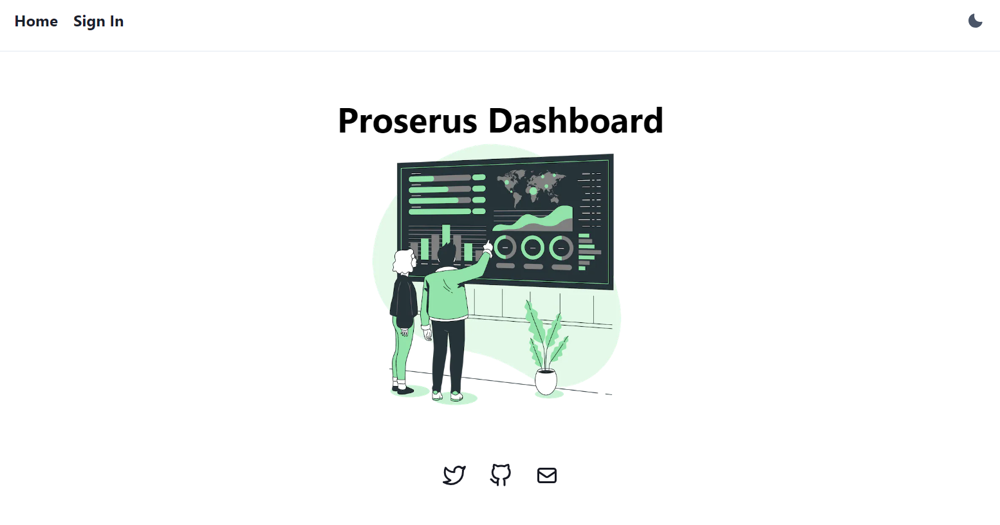
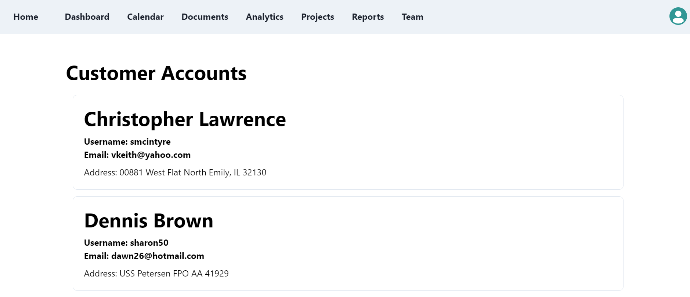
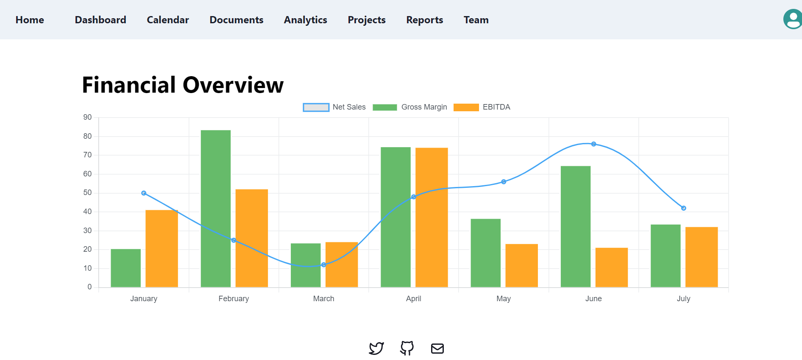
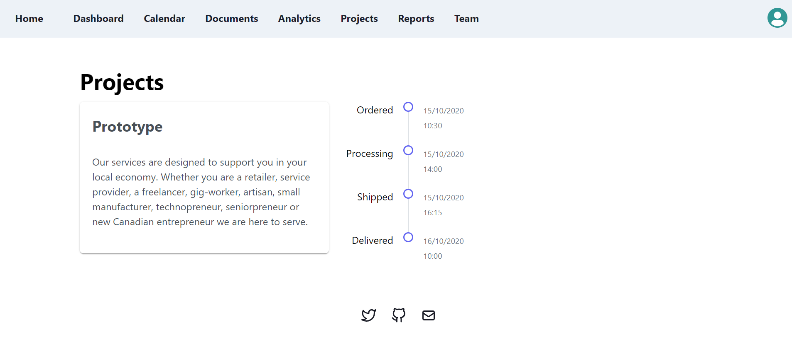
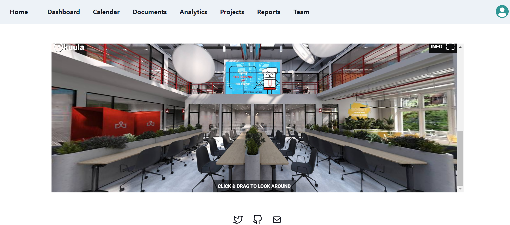

# Welcome to my Portfolio!

## 💡 Motivation 

I was interested in building a full stack dashboard. I went with building the frontend with Chakra UI and Next.js. I also wanted to start learning about databases, so I chose to integrate it with a MongoDB database and build out a simple REST API. I learned a lot about MongoDB, user authentication in Next.js with next-auth, and developing a REST API in this project. 

Feel free to [reach out](https://abneuro.vercel.app/contact) to me if you have any additional questions. There are lots of features that still need to be implemented!

## ✨ Pages 

1. **Home Page**: <br/>
 

2. **Analytics Page**: <br/>
 

3. **Dashboard Page**: <br/>
 

4. **Projects Page**: <br/>
 

5. **Team Page**: <br/>
 

## ⚡️ Technologies 

This site was built using Next.js and Chakra UI in the frontend. 

The backend consists of a MongoDB database.

**Why Next.js?**

Vercel make it really easy to deploy a website for free. In addition, I love the routing system and SEO benefits that Next.js offers. Next.js also makes it easy to work with API's!

The next time I do another project, I'm definitely looking forward to using TypeScript with Next.js!

**Why MongoDB?**

MongoDB has a free tier, in addition to being flexible and fast. I didn't want to use a relational database, knowing that I might modify the document structure.

**Here is a simple diagram showing how databases can be connected to a Next.js web app:**

 

### API Routes
- /api/auth to set up next-auth
- /api/customers to fetch mongodb data

### Important Libraries
- mongodb
- chart.js
- styled-components
## Future Improvements
1. Use api endpoints in client side components.
2. Develop MongoDB schema.
3. Wrap app with session tokens.

## 👏 Contribute 

Contributions are welcome as always. Before submitting a new pull request, please make sure to open a new issue.

## Getting Started

First, run the development server:

```bash
npm run dev
# or
yarn dev
# or
pnpm dev
```

Open [http://localhost:3000](http://localhost:3000) with your browser to see the result.

## Deploy on Vercel

The easiest way to deploy your Next.js app is to use the [Vercel Platform](https://vercel.com/new?utm_medium=default-template&filter=next.js&utm_source=create-next-app&utm_campaign=create-next-app-readme) from the creators of Next.js.

Check out the [Next.js deployment documentation](https://nextjs.org/docs/deployment) for more details.
